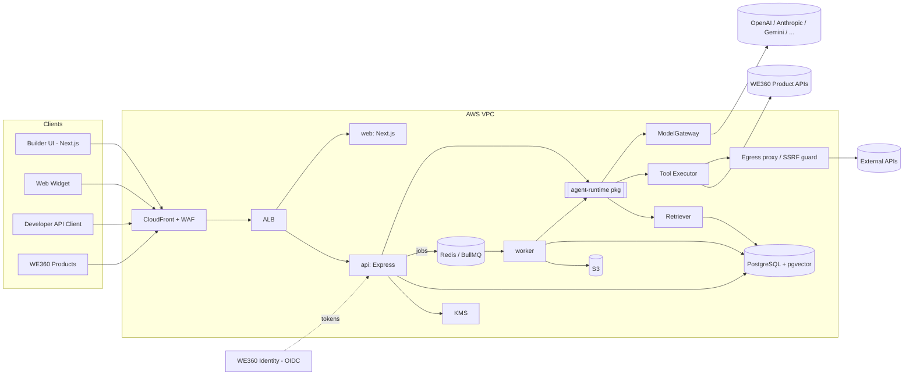

# 1. System Architecture

```mermaid
flowchart LR
  subgraph Clients
    U[Builder UI - Next.js]:::c
    W[Web Widget]:::c
    D[Developer API Client]:::c
    P[WE360 Products]:::c
  end
  subgraph AWS VPC
    CF[CloudFront + WAF] --> ALB
    ALB --> WEB[web: Next.js]
    ALB --> API[api: Express]
    API --> RT[[agent-runtime pkg]]
    API -- jobs --> R[(Redis / BullMQ)]
    R --> WK[worker]
    WK --> RT
    RT --> GW[ModelGateway]
    RT --> TX[Tool Executor]
    RT --> RET[Retriever]
    API --> PG[(PostgreSQL + pgvector)]
    WK --> PG
    RET --> PG
    WK --> S3[(S3)]
    TX --> EGR[Egress proxy / SSRF guard]
    API --> KMS[KMS]
  end
  GW --> LLM[(OpenAI / Anthropic / Gemini / ...)]
  EGR --> EXT[(External APIs)]
  TX --> WEAPI[(WE360 Product APIs)]
  IDP[WE360 Identity - OIDC] -.tokens.-> API
  U --> CF; W --> CF; D --> CF; P --> CF
```

