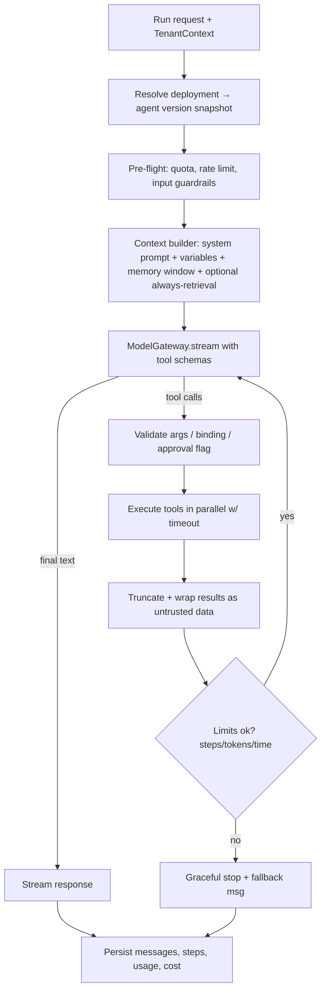

# 2. Agent Runtime Architecture

```mermaid
flowchart TB
  IN[Run request + TenantContext] --> RES[Resolve deployment → agent version snapshot]
  RES --> PRE[Pre-flight: quota, rate limit, input guardrails]
  PRE --> CTX[Context builder: system prompt + variables + memory window + optional always-retrieval]
  CTX --> LLM[ModelGateway.stream with tool schemas]
  LLM -->|tool calls| VAL[Validate args / binding / approval flag]
  VAL --> EXE[Execute tools in parallel w/ timeout]
  EXE --> OBS[Truncate + wrap results as untrusted data]
  OBS --> LIM{Limits ok? steps/tokens/time}
  LIM -->|yes| LLM
  LIM -->|no| STOP[Graceful stop + fallback msg]
  LLM -->|final text| OUT[Stream response]
  OUT --> PERSIST[Persist messages, steps, usage, cost]
  STOP --> PERSIST
```

