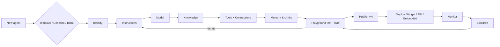

# 3. Agent Creation Flow

```mermaid
flowchart LR
  A[New agent] --> B{Template / Describe / Blank}
  B --> C[Identity] --> D[Instructions] --> E[Model]
  E --> F[Knowledge] --> G[Tools + Connections] --> H[Memory & Limits]
  H --> T[Playground test - draft]
  T -->|iterate| D
  T --> PUB[Publish vN]
  PUB --> DEP[Deploy: Widget / API / Embedded]
  DEP --> MON[Monitor] --> IMP[Edit draft] --> T
```

