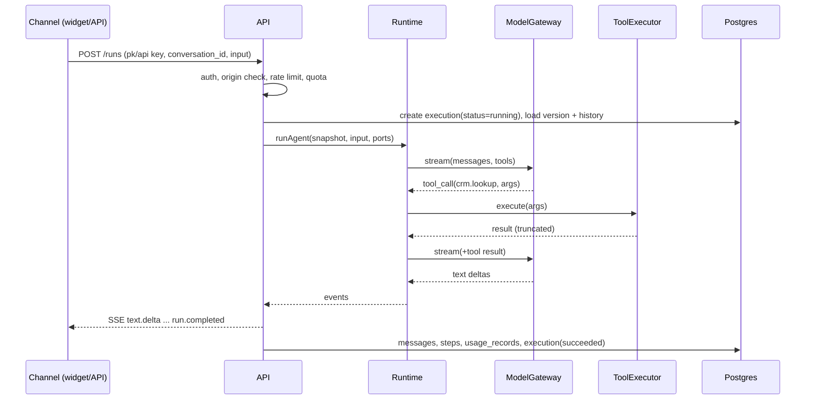

# 4. Agent Execution Flow (sequence)

```mermaid
sequenceDiagram
  participant C as Channel (widget/API)
  participant A as API
  participant RT as Runtime
  participant M as ModelGateway
  participant T as ToolExecutor
  participant DB as Postgres
  C->>A: POST /runs (pk/api key, conversation_id, input)
  A->>A: auth, origin check, rate limit, quota
  A->>DB: create execution(status=running), load version + history
  A->>RT: runAgent(snapshot, input, ports)
  RT->>M: stream(messages, tools)
  M-->>RT: tool_call(crm.lookup, args)
  RT->>T: execute(args)
  T-->>RT: result (truncated)
  RT->>M: stream(+tool result)
  M-->>RT: text deltas
  RT-->>A: events
  A-->>C: SSE text.delta ... run.completed
  A->>DB: messages, steps, usage_records, execution(succeeded)
```

