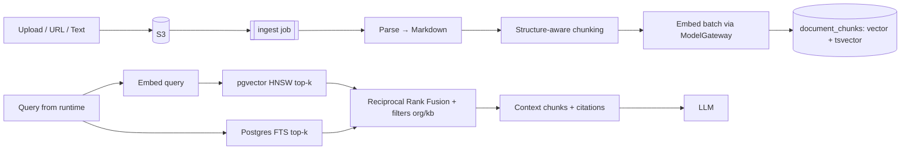

# 5. Knowledge / RAG Flow

```mermaid
flowchart LR
  UP[Upload / URL / Text] --> S3[(S3)] --> Q[[ingest job]]
  Q --> PARSE[Parse → Markdown] --> CH[Structure-aware chunking]
  CH --> EMB[Embed batch via ModelGateway] --> PGV[(document_chunks: vector + tsvector)]
  QRY[Query from runtime] --> QE[Embed query]
  QE --> VS[pgvector HNSW top-k]
  QRY --> FTS[Postgres FTS top-k]
  VS --> RRF[Reciprocal Rank Fusion + filters org/kb]
  FTS --> RRF
  RRF --> CTXT[Context chunks + citations] --> LLM[LLM]
```

