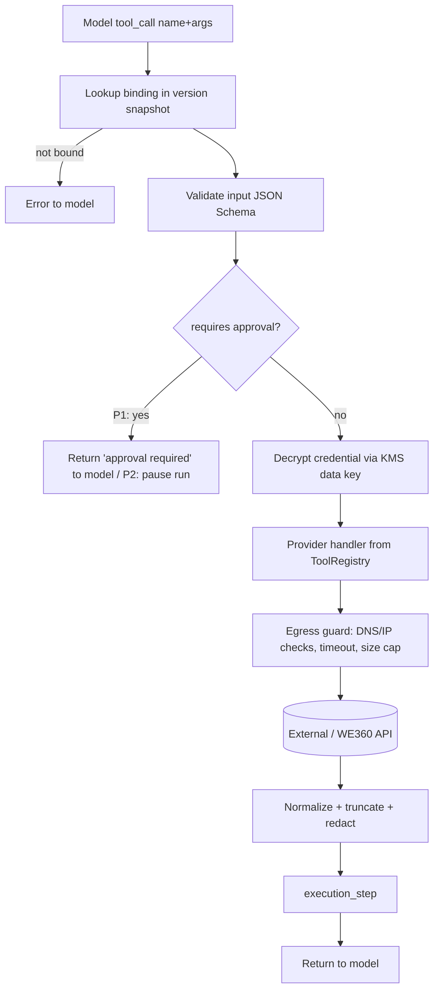

# 6. Tool Execution Flow

```mermaid
flowchart TB
  CALL[Model tool_call name+args] --> LOOK[Lookup binding in version snapshot]
  LOOK -->|not bound| REJ[Error to model]
  LOOK --> SCH[Validate input JSON Schema]
  SCH --> APR{requires approval?}
  APR -->|P1: yes| NEED[Return 'approval required' to model / P2: pause run]
  APR -->|no| CRED[Decrypt credential via KMS data key]
  CRED --> PROV[Provider handler from ToolRegistry]
  PROV --> EG[Egress guard: DNS/IP checks, timeout, size cap]
  EG --> EXT[(External / WE360 API)]
  EXT --> RES[Normalize + truncate + redact]
  RES --> TRACE[execution_step] --> BACK[Return to model]
```

