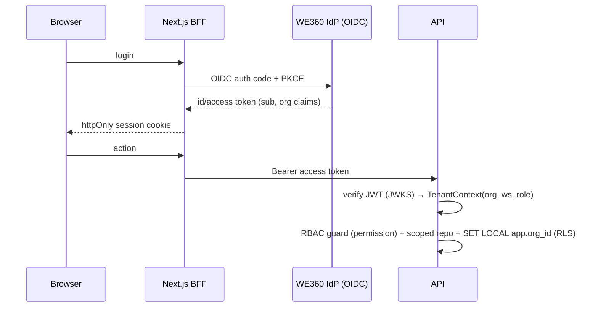

# 7. Authentication / Authorization

```mermaid
sequenceDiagram
  participant B as Browser
  participant W as Next.js BFF
  participant I as WE360 IdP (OIDC)
  participant A as API
  B->>W: login
  W->>I: OIDC auth code + PKCE
  I-->>W: id/access token (sub, org claims)
  W-->>B: httpOnly session cookie
  B->>W: action
  W->>A: Bearer access token
  A->>A: verify JWT (JWKS) → TenantContext(org, ws, role)
  A->>A: RBAC guard (permission) + scoped repo + SET LOCAL app.org_id (RLS)
```

