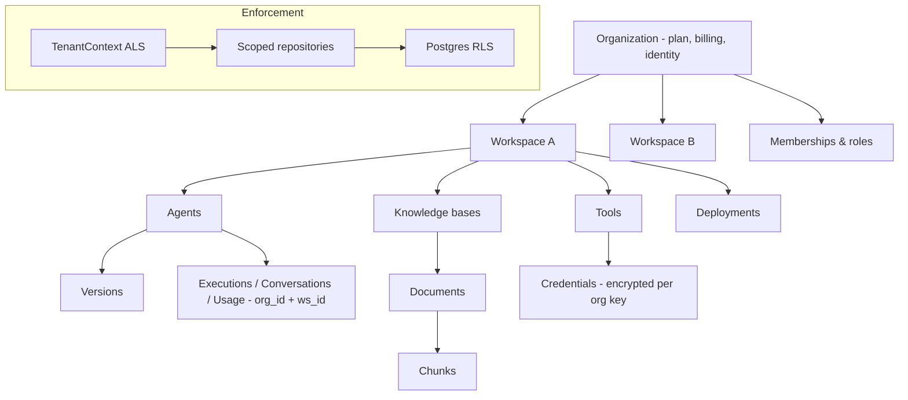

# 8. Multi-Tenant Architecture

```mermaid
flowchart TB
  ORG[Organization - plan, billing, identity] --> WS1[Workspace A]
  ORG --> WS2[Workspace B]
  ORG --> MEM[Memberships & roles]
  WS1 --> AG[Agents] --> V[Versions]
  WS1 --> KB[Knowledge bases] --> DOC[Documents] --> CHK[Chunks]
  WS1 --> TL[Tools] --> CR[Credentials - encrypted per org key]
  WS1 --> DP[Deployments]
  AG --> EX[Executions / Conversations / Usage - org_id + ws_id]
  subgraph Enforcement
    TC[TenantContext ALS] --> REPO[Scoped repositories] --> RLS[Postgres RLS]
  end
```

