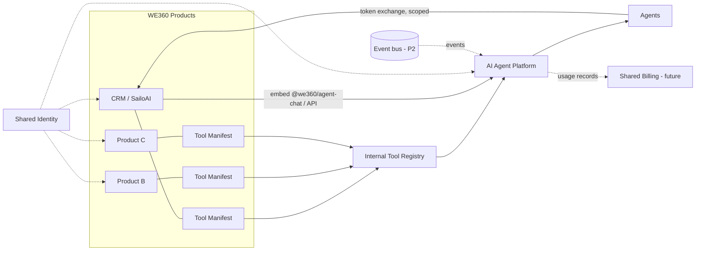

# 9. WorkEasy360 Integration

```mermaid
flowchart LR
  subgraph WE360 Products
    PA[CRM / SailoAI] --- MA[Tool Manifest]
    PB[Product B] --- MB[Tool Manifest]
    PC[Product C] --- MC[Tool Manifest]
  end
  MA --> REG[Internal Tool Registry]
  MB --> REG
  MC --> REG
  REG --> PLAT[AI Agent Platform]
  PLAT --> AGT[Agents]
  AGT -- token exchange, scoped --> PA
  PA -- embed @we360/agent-chat / API --> PLAT
  IDP[Shared Identity] -.-> PLAT & PA & PB & PC
  BUS[(Event bus - P2)] -.events.-> PLAT
  PLAT -. usage records .-> BILL[Shared Billing - future]
```

