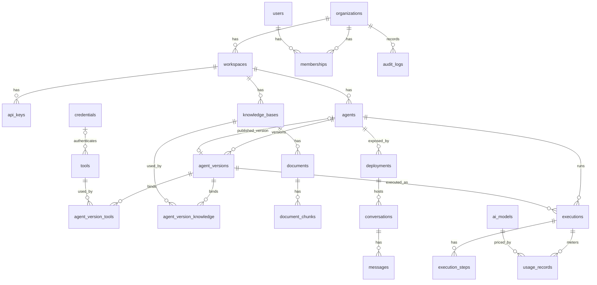

# 11. Database ER Diagram

```mermaid
erDiagram
  organizations ||--o{ workspaces : has
  organizations ||--o{ memberships : has
  users ||--o{ memberships : has
  workspaces ||--o{ api_keys : has
  workspaces ||--o{ agents : has
  agents ||--o{ agent_versions : versions
  agents |o--o| agent_versions : published_version
  agent_versions ||--o{ agent_version_tools : binds
  agent_versions ||--o{ agent_version_knowledge : binds
  tools ||--o{ agent_version_tools : used_by
  knowledge_bases ||--o{ agent_version_knowledge : used_by
  credentials |o--o{ tools : authenticates
  workspaces ||--o{ knowledge_bases : has
  knowledge_bases ||--o{ documents : has
  documents ||--o{ document_chunks : has
  agents ||--o{ deployments : exposed_by
  deployments ||--o{ conversations : hosts
  conversations ||--o{ messages : has
  agents ||--o{ executions : runs
  agent_versions ||--o{ executions : executed_as
  executions ||--o{ execution_steps : has
  executions ||--o{ usage_records : meters
  ai_models ||--o{ usage_records : priced_by
  organizations ||--o{ audit_logs : records
```

---

